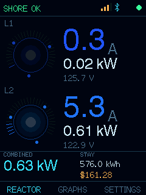
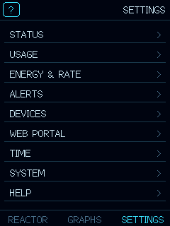
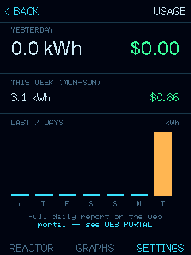
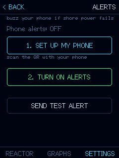
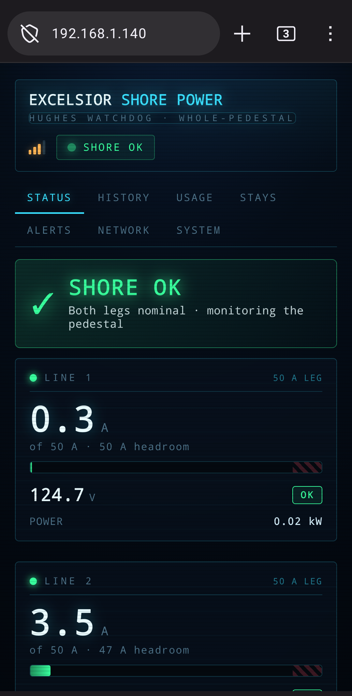
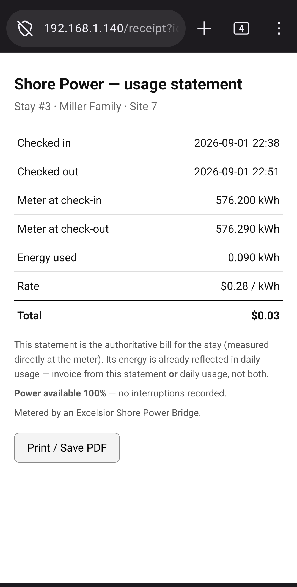

# hughes_bridge — Hughes Power Watchdog (Gen 1, 50A) BLE→WiFi bridge

Firmware for a **2.8" ESP32-S3 touchscreen** module (sold as Hosyond; hardware ref:
[lcdwiki 2.8inch ESP32-S3 Display](https://www.lcdwiki.com/2.8inch_ESP32-S3_Display)).
It sits near the shore-power inlet, holds a BLE connection to the **Hughes Power
Watchdog** (Gen 1, Bluetooth-only, 50A), decodes **both legs** of the feed, and both
(a) drives a live on-screen **reactor UI** at the bay and (b) re-serves the data as
JSON at `http://<esp-ip>/status` for raspbpi's `hughes-collect` (separate service,
not built yet) to sample into a **powerplant dashboard** on the local network.

**Board:** ESP32-S3 **N16R8** (16MB flash, 8MB OPI PSRAM — PSRAM stays OFF), **native
USB** (Type-C, no UART chip — hence the CDC flag). Display **ILI9341V** 240×320 SPI +
touch **FT6336** (I2C); SD card on a dedicated SDMMC bus. Pin map in `docs/ARCHITECTURE.md`.

**What it does now:** two animated per-leg *reactor cores* that heat blue→white→red
with load, live amps/kW/V, a stay-kWh + $cost readout, a persistent power-history
**graph** (5/10/30 min, SD-backed so it survives power loss), touch **settings**, a
terminal-style **boot screen**, **idle sleep**, and — the one write path — a standalone
**odometer reset** over BLE (the `RESEt` command, reverse-engineered from the phone app;
Gen 1 was long thought command-less). See [`docs/ARCHITECTURE.md`](docs/ARCHITECTURE.md)
for the why of everything (protocol, decode, command channel).

## Screenshots

<p align="center">
  
  
  
  
</p>
<p align="center"><em>On the box — reactor &middot; menu &middot; daily usage &middot; alerts</em></p>

<p align="center">
  
  
</p>
<p align="center"><em>On your phone — the live web portal &middot; a printable guest receipt</em></p>

## ⚠️ "Send diagnostics" only reaches a backend YOU run

The firmware has an optional, owner-initiated **Send diagnostics** button — a
"support bundle" of device status + recent logs, sent **only when you tap it**,
never automatically and never in the background.

**This public build sends that to nobody.** The support host and token are
placeholders (`support.example.com` / unset), so a device flashed from this
repo — or from the prebuilt image in [`bin/`](bin/) — **will not send anything to
the original author, to me, or to any server. Nothing phones home.**

To use the feature you must **stand up your own receiver** and point the firmware
at it:

- set your own host in `src/main.cpp` (`SUPPORT_HOST`), and
- copy `src/support_token.example.h` → `src/support_token.h` with a token your
  receiver accepts.

Until you do that the button is inert — which is the intended default.

## Why it exists

The Victron/Cerbo system is fed off **one leg** of the 50A connector and only
covers inside-the-house loads — so the powerplant dashboard currently sees about
half the rig. The Watchdog meters **both legs at the pedestal** = the whole rig =
the number the park actually bills. This bridge is how that number reaches the
dashboard.

## This is PlatformIO, not the Arduino IDE

Every per-board setting that the IDE kept losing — flash layout, "USB CDC On
Boot", the core version — is pinned in [`platformio.ini`](platformio.ini) and
travels with the project. Nothing to remember per board.

It uses the **pioarduino** platform (not the official `espressif32`) to get
Arduino **core 3.x**, which pairs with **NimBLE-Arduino 2.x** — the same BLE
stack already proven on `easytouch_bridge`.

## Quickstart

The bridge is **self-provisioning** — no `config.h` needed for a normal setup.

```bash
pio run -e bridge -t upload             # flash the firmware
```

On first boot (or any time it can't join WiFi) it comes up as an **open WiFi AP
`Hughes-Setup`** with a **magenta** status LED. From a phone:

1. Join `Hughes-Setup`. A setup page auto-pops (or browse to `http://192.168.4.1`).
2. Pick your WiFi network + password.
3. Tap **Scan for Watchdogs** and select yours. If several appear, yours is the
   strongest RSSI — power-cycle it (it's inline on the shore feed, so this briefly
   drops shore power; the inverter carries the house) to confirm which drops.
4. **Save & reboot.** It rejoins your WiFi, LED goes **green**, and it serves
   `/status`.

To re-run setup later: `curl -X POST http://<esp-ip>/reprovision` (clears WiFi +
Watchdog, reboots to the portal). A wrong WiFi password self-heals — a failed join
drops back to the portal on its own.

**Optional dev seed / diagnostics:**

```bash
# Seed config without the portal: copy include/config.example.h -> include/config.h,
# fill WiFi + HUGHES_MAC. It seeds NVS ONCE on first boot (a "seeded" sentinel keeps
# it from overriding a later /reprovision). Handy for bench work.

# Bare BLE scan to stdout (no WiFi/portal) — for a screenless brand-new board:
pio run -e scan -t upload -t monitor
```

## Download a prebuilt image (no toolchain needed)

Flash-ready v2.1.0 images live in [`bin/`](bin/):

- **`bin/hughes_bridge-2.1.0.factory.bin`** — full image for a **blank board**, flashed at `0x0`:
  ```bash
  esptool.py --chip esp32s3 --port <YOUR_PORT> write_flash 0x0 bin/hughes_bridge-2.1.0.factory.bin
  ```
  (or use the browser flasher https://espressif.github.io/esptool-js/ — add the file at offset `0x0`).
- **`bin/hughes_bridge-2.1.0.bin`** — app-only image (`0x10000`), for OTA if you host your own manifest.

Checksums: [`bin/SHA256SUMS`](bin/SHA256SUMS). Built from the sanitized public source
(no credentials, no backend host — see the "Send diagnostics" note above). After
flashing a blank board, follow **Quickstart** to provision it.

## Flashing note — native USB, no UART chip

The Type-C port is **USB-CDC only** (there's no CP2102/CH340). So:

- The port shows up as **USB-CDC** — `/dev/ttyACM*` on Linux/mac, a COM port on
  Win10+ — **not** `/dev/ttyUSB*`. If PlatformIO can't find it, that's why.
- There's no auto-reset circuit, so the **first** upload may need the manual
  bootloader entry: **hold BOOT, tap RESET, release BOOT**, then upload.
- `-DARDUINO_USB_CDC_ON_BOOT=1` (set in `platformio.ini`) is what makes serial
  appear at all — without it the monitor stays silent.

## Status LED

Onboard NeoPixel (GPIO 42) shows state at a glance, no serial needed:
**blue** = connecting · **green** = connected + data flowing · **red** = not
found / link gone silent · **magenta** = setup portal (`Hughes-Setup` AP up). Set
`LED_PIN -1` in `config.h` to disable.

## `/status` shape

```json
{
  "bridge": "hughes-esp32",
  "connected": true,
  "rssi": -63,
  "error": "",
  "legs": [
    {"line":1,"volts":121.8,"amps":18.4,"watts":2241,"kwh":37.900,"hz":60.0,"err":0,"age_s":1,"raw":"010320..."},
    {"line":2,"volts":121.6,"amps":11.2,"watts":1362,"kwh":24.100,"hz":60.0,"err":0,"age_s":1,"raw":"010320..."}
  ],
  "combined_watts": 3603,
  "combined_kwh": 62.000
}
```

- `kwh` is a **lifetime odometer**, not per-stay. The stay baseline + manual
  reset live in `hughes-collect`, not here — this stays dumb on purpose.
- `raw` is the last 40-byte packet as hex, so the collector can re-derive a field
  without a reflash if any scaling turns out off on real hardware.
- A leg is `null` until its first packet; on a 30A unit line 2 stays `null`.

## Layout

```
platformio.ini          board + platform + the two build envs
src/main.cpp            scan mode (#ifdef SCAN_ONLY) and bridge mode in one file
include/config.example.h    copy to config.h (gitignored)
docs/ARCHITECTURE.md    design, protocol tables, roadmap — read this
bin/                    prebuilt v2.1.0 firmware images + checksums
```

## Status

**Phase 1 (done):** headless bridge, validated on real hardware — serves clean
`/status`. The `hughes-collect` service + dashboard section are separate raspbpi
work items, not yet built.

**Phase 2 (in progress):** turning this into a smart standalone unit — captive-portal
setup (done), then the 2.8" touchscreen as the primary UI (reactor page + 5/10/30-min
graphs) with optional on-SD history. See `docs/ARCHITECTURE.md` for the design.


## Parts to order: ~ $50
**You need one of the following ESP32-S3 boards. Both companies ship the same exact backend board.**
- Board Details: https://www.lcdwiki.com/2.8inch_ESP32-S3_Display
- https://www.amazon.com/dp/B0FH9XHXRT
- https://www.amazon.com/dp/B0FKG7WRWV

**You can install a battery if you want, that way you can unplug and move it.**
**Any 3.7v battery with a JST 1.25mm connector will work. Ive been using these:**
- https://www.amazon.com/dp/B0FH9XHXRT

**You need a 32GB or smaller Micro SD Card, larger cards are not readable by the board.**
- https://www.amazon.com/dp/B0C1Y87VT3
