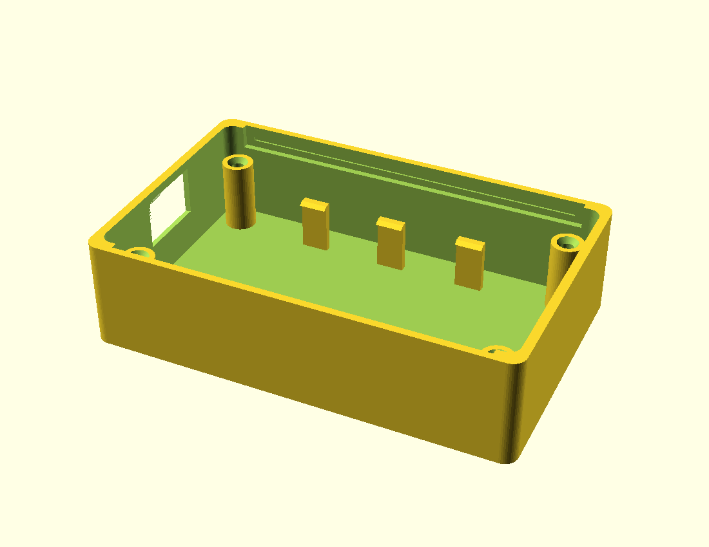
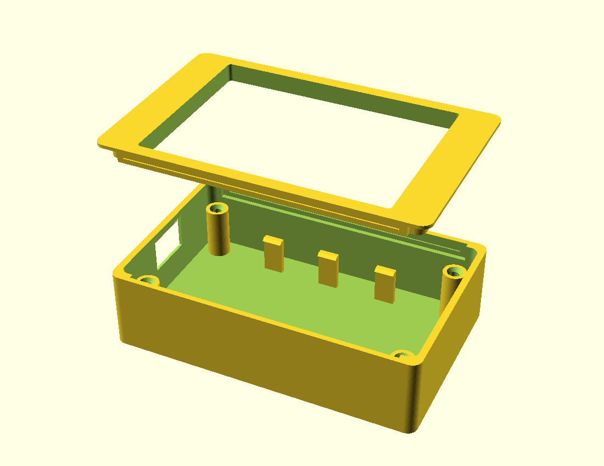

# hughes_bridge case

Parametric enclosure for the 2.8" ESP32-S3 board (QDtech **ES3C28P**), with a bay
for a **1S LiPo** behind the board. Two printed parts: a **back shell** (holds the
PCB on posts, cradles the battery) and a **flush bezel** (edge-to-edge frame around
the glass that **snaps** to the shell — **no screws**). `hughes_case.scad` — open in
OpenSCAD, set `part`, render, export STL.

**Forked 2026-08-31 from `intercom/intercom_case`** (same board) to inherit its
screwless snap-rim retention, flush edge-to-edge bezel, wall-rim stiffener, and USB-C
relief. Retuned for hughes: **speaker off**, the bigger **65mm** AKZYTUE 103450 pack,
**pop-in battery clips**, no mic hole. The speaker machinery is kept (`speaker=false`)
so the ledger's future alarm-speaker mount is a one-flag flip away.

*Validated headless (OpenSCAD 2021.01 / this machine): `back`, `bezel`, and
`bezel_legacy` all render as single manifold solids. **Back shell 92.4 × 58.4 ×
23.9mm**, flush bezel × 6.9mm (print orientation). Width is +2.0mm over the old
screw case (56.4mm) — that's the `wall_y`=3 rim stiffener. What's **not** verified is
real-board fit — see the measure-these parameters below.*

## Retention — no screws (the snap-rim "rib" system)

The board and bezel are held **without fasteners**:

- **Four Ø3 pins** on the bezel (`flush_pin_d`) drop into the board's M3 holes to
  center it. The board is sandwiched between the back **posts** (below) and the
  bezel's **inner skirt** (above), which presses it flat onto the post tops.
- A **lip** on the bezel's two long edges nests into a **rabbet** cut in the wall
  tops (`bezel_rim`), and an optional **snap bead + groove** (`bezel_snap`) gives a
  gentle click that holds the lid on. That same lip **braces the long walls** (they
  bowed at the center without it), which is why the long walls are thickened to
  `wall_y`=3mm (outward only — cavity/PCB fit unchanged; it's why the case is 58.4mm
  wide). The snap fit is clearance-sensitive — **tune `rim_clr` / `snap_bead` on a
  test print** (interference = `snap_bead − rim_clr`, default 0.15mm).

The posts still carry M3 self-tap pilots, so you *can* fall back to screws if you
ever want them; the default assembly uses none. The original over-the-glass screw
bezel is kept as `part="bezel_legacy"` for reference.

## Flush bezel (`part="bezel"` — the current bezel)

The bezel frames the touch panel instead of covering its borders, so the whole
screen — including the corners — is tappable (good for the on-screen nav bar). The
window fits **around the glass** (STEP-measured 69.2 × 50, centered; full PCB width,
so no lip on the long edges). It's an **edge-to-edge stepped** frame: a **1 mm-proud
cap** (`flush_proud`) runs over the whole footprint flush with the case outer edge —
covering the wall tops so a face-down drop lands on the full rim — while an **inner
skirt steps down to sit flush on the PCB front** and press the board flat. It
**renders print-ready** face-down (cap on the bed / pins up).

**Parts** (`part` = ): `back` (shell) · `bezel` (this flush bezel) · `both` (the two
side by side) · `assembled` (bezel on the case — fit preview) · `bezel_legacy` (the
original over-the-glass bezel, kept for reference).

## Preview




**Note: the committed preview PNGs are from the old screw case and are stale** —
regenerate them after this fork. On a Linux devbox (no display) the original flow was:

```bash
for p in back bezel; do
  QT_QPA_PLATFORM=offscreen openscad -o /tmp/hc_$p.stl -D "part=\"$p\"" hughes_case.scad
done
./stl_preview.py preview/back.png     "back shell" 26 -58  /tmp/hc_back.stl,0,#5b6b7a
./stl_preview.py preview/bezel.png    "bezel"      32 -58  /tmp/hc_bezel.stl,0,#8a8f98
./stl_preview.py preview/exploded.png "exploded"   22 -58  /tmp/hc_back.stl,0,#5b6b7a /tmp/hc_bezel.stl,30,#8a8f98
```

On a machine with OpenSCAD's GL (e.g. Windows) you can skip matplotlib and export
PNGs directly: `openscad -o preview/back.png --imgsize=1100,850 --viewall --autocenter -D 'part="back"' hughes_case.scad`.

## The battery — yes, the board charges it

The board has an onboard **TP4054** single-cell LiPo charger + a battery-voltage
ADC. Plug in USB-C and it runs the board *and* charges the cell.

**Cell:** AKZYTUE 2000mAh 103450 1S LiPo w/ PCM (measured pack 10×36×65). The bay
is sized for it (`bat_l/bat_w/bat_t`), and it's held by **pop-in clips** (see below).

**Connector — confirmed from the QDtech spec:** the board's battery header (JP1)
is a **1.25mm 2-pin socket** ("1.25mm 2P 座子，用于接入 3.7V 聚合锂电池"), and the
board ships with a 1.25mm→2.54mm adapter lead. The AKZYTUE's **Micro JST 1.25mm**
plug matches it — no adapter needed. (Note: a JST-PH 2.0mm battery would *not*
fit this board.)

**Still mandatory before first plug-in: polarity.** "1.25mm" is the connector,
not the wiring — vendors wire +/− either way. Plug in USB-C, meter the board's two
BAT pads to find **+**, and confirm the battery's red wire lands there. Reversed =
dead board / fire. Also don't trap the cell against the charger/regulator heat.

## What's exact vs. what you must measure

Exact, from the vendor drawing: PCB 86×50×1.6, M3 holes on 78×42, screen visible
area 43.6×58, LCD 4.3mm proud, back SMD 4.7mm. The case is built around these.

**Measure these on the board (or read `ES3C28P_3D.step`) — they're parameters,
not in the drawing:**

- `usbc_end` / `usbc_off_y` — which short edge the USB-C is on, and its Y offset.
  (STEP says dead-centered on the −X edge; that's the default.)
- `usbc_relief_d` — the recess you measure from the outer face to the receptacle
  mouth, so the flared relief seats the plug near-flush.
- `button_holes` + `boot_xy` / `reset_xy` — poke-holes for BOOT/RESET (off by
  default; the coords are placeholders).

A caliper and two minutes gets all of them. The STEP (`../reference/.../ES3C28P_3D.step`,
local only) has them precisely if you'd rather model against it in FreeCAD/Fusion.

## Print / assembly

- PLA/PETG, 0.2mm, 3 perimeters. Both parts print flat, no supports. The **flush
  bezel** prints **face-down** (cap on the bed, pins/skirt up). The USB-C slot in the
  shell bridges a couple mm — fine, or drop `usbc_h`.
- **No fasteners.** Drop the PCB onto the four Ø7 post tops (pins optional to seat
  it), then press the bezel on: the four Ø3 pins center the board and the long-wall
  lip snaps into the wall-top rabbet. To go back to screws instead, use
  `part="bezel_legacy"` and M3×10/×12 self-tapping into the post pilots.
- **Battery:** the 65mm pack sits in the floor bay under the PCB, held by **pop-in
  clips** (`bat_clips`) on its two long sides — **3 per side** (x = −18.5 / 0 / +18.5),
  thin flexing walls with an overhang catch so the cell snaps in and lifts out for
  replacement, no tape. Its 65mm length keeps the ends clear of the corner posts, so
  no post flats are needed. (`bat_retain=true` swaps the clips for the old rails +
  end-stops with a wire-exit notch, if you prefer.)
- Depth is driven by `bat_t` (speaker off). With this pack the case is ~24mm deep —
  fine for a bay/wall mount near the shore inlet.

## Fit check before you commit to a long print

Render `part="back"`, export, and print **just the post ring + one wall** (or a
2mm-tall slice) first to confirm the 78×42 posts and the USB-C slot line up with
the real board. Then dry-fit **one battery clip** and the **bezel snap** on that slice
before the full print. Cheaper than finding out on a 4-hour print.

## Heads-up: the scabbard no longer fits

`hughes_scabbard.scad` was measured to the **old** printed case (56.30mm wide). This
fork is **58.4mm wide** (the `wall_y`=3 stiffener), so the current scabbard cavity is
~2mm too narrow. If you still want the slide-in sleeve, re-measure the new printed
case and bump `case_w` in the scabbard (it's parametric), or drop `wall_y` back to 2
here to keep the old width — at the cost of the wall stiffener the rib system relies on.
